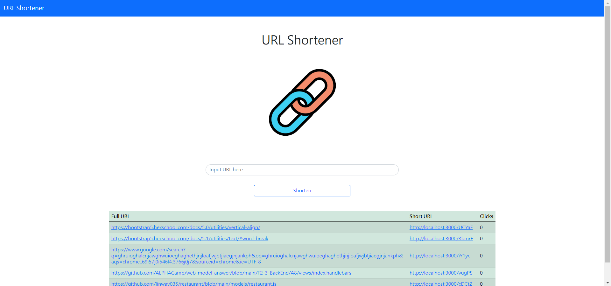

# 短網址產生器 (URL shortener)

提供一個由 5 個英文數字組成的短代碼以替代原來較長的 URL，將長的 URL 位址縮短。

---

## 專案畫面



---

## 環境建置與需求 (prerequisites)

- Node.js 14.16.0
- Express 4.17.1
- Express-handlebars 3.0.0
- Bootstrap 5.1.3
- Font-awesome 6.2.0
- Mongoose 5.9.7

## 使用說明

1. 請先確認有安裝 node.js 與 npm
2. 透過終端機，Clone 此專案至本機電腦

   ```bash
   git clone https://github.com/linway035/restaurant.git
   ```

3. 透過終端機，cd 至存放的資料夾
4. 啟動伺服器，執行 app.js 檔案
   ```bash
    nodemon app.js
   ```
5. 成功連結後，開啟任一瀏覽器瀏覽器輸入 http://localhost:3000/ 開始使用

## 網站功能介紹

- 將一網址輸入後，按下 Shorten，即提供一組縮網址，可供複製或點選
- 首頁下方有表格可查看或點選先前縮短過的網址
